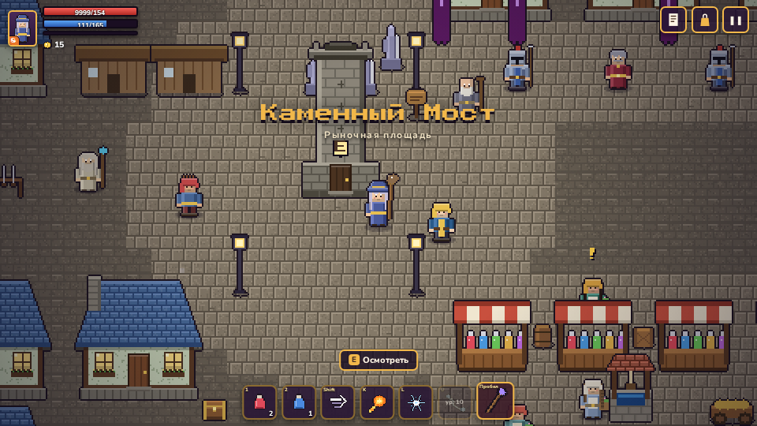
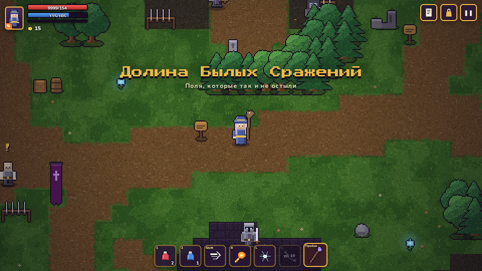
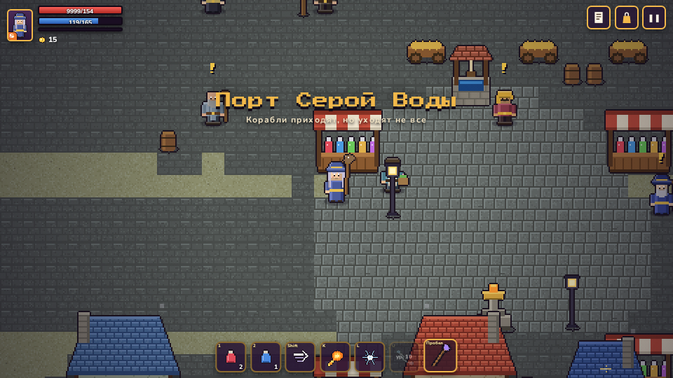

# Эмбервейл

Пиксельная фэнтези-RPG с боем в реальном времени. Выбери класс (воин, маг или разбойник), исследуй мир, сражайся с чудовищами, выполняй задания и спаси мир от Скверны. Играется в браузере (в том числе на телефоне), без сборки и зависимостей.

**Играть:** опубликованная версия на GitHub Pages (workflow `static.yml`) или локально:

```bash
npm start            # или: python3 -m http.server 8000
# открыть http://localhost:8000
```

Игра использует ES-модули, поэтому `index.html` нужно открывать через HTTP, а не через `file://`.






## Сюжет

Демиург создал мир и богов и замолчал. Между веком героев и нашим временем лежит забытый век: в нём была война, о которой не помнит никто. Нынешние боги были людьми и стали богами, убив прежних или получив силу из их рук. Маяки, поглощавшие лишнюю магию, гаснут; люди превращаются в Эхо; видящим снится война.

Герой идёт из Тихого Брода через шесть локаций к Цитадели, где умирает Последний Прежний, и решает, чем всё закончится. Подробно: [docs/STORY.md](docs/STORY.md).

- **Семь богов** следят за каждым решением. Репутация скрыта, ранги можно узнать только у Слушающей в Храме Семи. Проклятие навсегда.
- **Шесть локаций:** Тихий Брод (деревня, шахта в три этажа, лес, топи), Каменный Мост (город), Долина Былых Сражений, Горный край, Побережье, Цитадель.
- **Развилки:** судьба Тобиаса и Грока, сторона в споре о маяках, версия войны и кому показать улики, семь квестов богов в духе Даэдра, три классовых квеста.
- **Четыре финала:** закрыть эпоху, запечатать, освободить, занять Престол (секретный).
- **Лики** (клавиша `R`): артефакты прежней эпохи, дающие на время силу бога.
- **Дерево навыков** (клавиша `T`): три ветки на класс, до 20 уровня.

## Управление

| Действие | Клавиатура / мышь | Телефон |
|---|---|---|
| Ходьба | `WASD` или стрелки | плавающий джойстик слева |
| Атака | `Пробел`, `J` или левая кнопка мыши (целится в курсор) | большая кнопка справа |
| Навыки 1 / 2 / 3 | `K` / `L` / `U` (третий с 10 ур.) | кнопки справа |
| Лик | `R` | кнопка справа |
| Дерево навыков | `T` | вкладка «Навыки» |
| Уклон (перекат, скачок, кувырок) | `Shift` | кнопка справа |
| Говорить, открыть, потянуть, помолиться | `E` | кнопка «E» появляется рядом с объектом |
| Зелье здоровья / маны | `1` / `2` | кнопки слева от навыков |
| Сумка и герой / журнал | `I` / `Tab` | значки сверху справа |
| Пауза | `Esc` или `P` | значок ❚❚ |

Без мыши удар сам доводится до ближайшего врага в направлении движения. Играть на телефоне лучше в горизонтальном положении.

## Классы

| Класс | Стиль | Навыки (1 / 5 / 10 ур.) | Уклон |
|---|---|---|---|
| **Воин** | много здоровья, ближний бой | Вихрь, Боевой клич, Сокрушающий удар | перекат |
| **Маг** | хрупкий, сильный на расстоянии | Огненный шар, Ледяная нова, Цепная молния | скачок-блинк |
| **Разбойник** | быстрый, критует | Веер ножей, Теневой шаг, Танец клинков | кувырок |

Уровень до 20. Очко навыков за каждый уровень и за важные задания; в дереве три ветки на класс с пассивками и улучшениями активных навыков. Снаряжение: оружие, броня, амулет и Лик.

## Мир

Шесть локаций, 29 областей (см. `AREAS` в `js/defs.js`). Алтари лечат и сохраняют прогресс. При гибели герой просыпается у последнего алтаря и теряет 10% золота. Боссы телеграфируют атаки красными зонами.

## Устройство кода

```
index.html, css/         интерфейс (DOM поверх canvas)
js/defs.js               константы, классы, предметы, враги
js/maps*.js, areas_l1-6.js   карты областей (генерация с фиксированным seed)
js/state.js              состояние героя, характеристики, инвентарь
js/quests.js, story_*.js  движок квестов; NPC, квесты и диалоги по локациям
js/gods.js, skills.js    репутация богов, дерево навыков
js/endings.js            финалы и эпилог
js/world.js, ai.js       игровая логика: бой, ИИ врагов и боссов, лут (без DOM)
js/sprites_*.js, px.js   весь пиксель-арт рисуется кодом
js/render.js             камера, слои, частицы, освещение подземелий
js/ui.js, input.js       HUD, диалоги, сумка/журнал/магазин, джойстик
js/audio.js              музыка и звуки синтезируются в Web Audio
js/save.js               сохранения в localStorage
tests/                   проверки данных, систем и мира
tools/                   скриншоты и вспомогательные страницы (Playwright)
```

Логика мира не зависит от DOM, поэтому запускается и в Node: на этом построены тесты.

## Тесты

```bash
npm test             # данные + системы + смоук
node tests/ascii.mjs village   # нарисовать карту текстом
```

- `tests/validate.mjs`: достижимость всех объектов на картах, ссылки диалоговых узлов и эффектов, квесты и источники предметов.
- `tests/systems.mjs`: репутация и проклятия, дерево навыков, сквозной прогон диалогов Локации 1.
- `tests/smoke.mjs`: минута игрового времени для каждого класса.

## Публикация

Workflow `.github/workflows/static.yml` выкладывает репозиторий целиком на GitHub Pages при пуше в `main`. Манифест и сервис-воркер позволяют установить игру на главный экран телефона (на iPhone: «Поделиться» → «На экран Домой»).

Сделано в одном стиле с «Шерстинами» — MurMyak Games.
