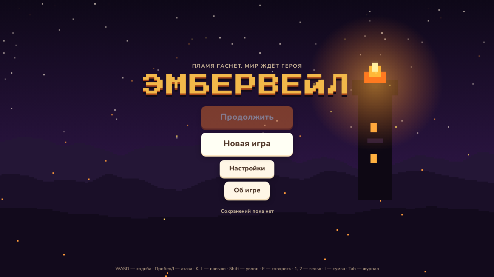
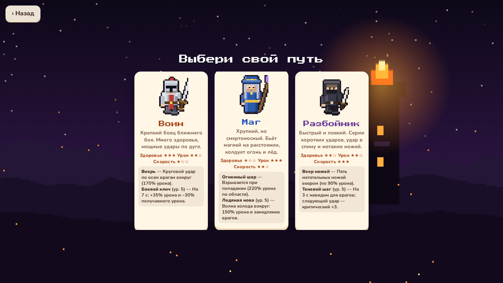
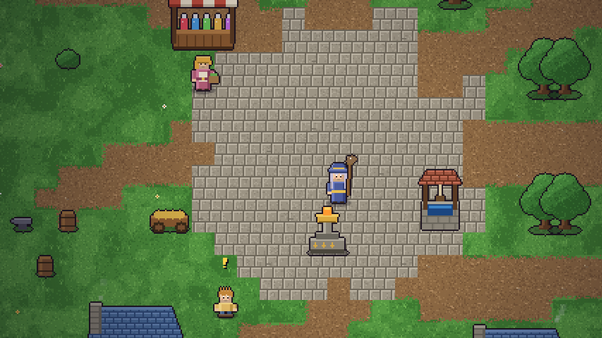
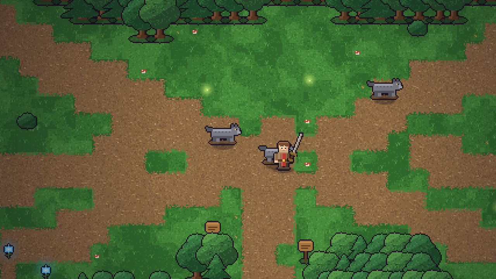
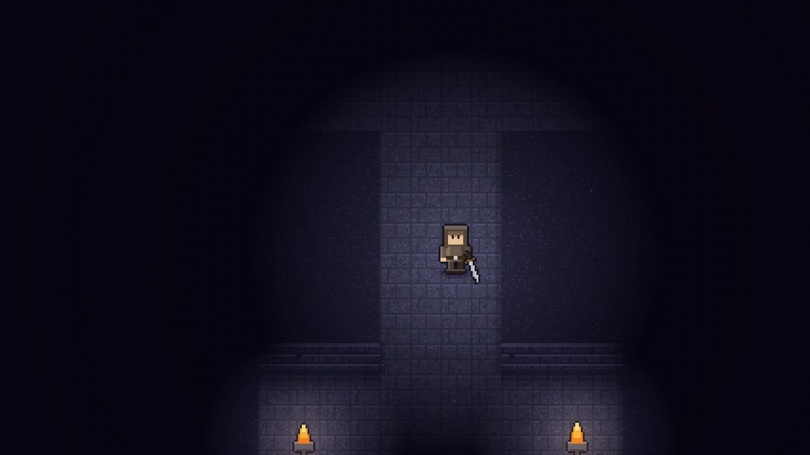
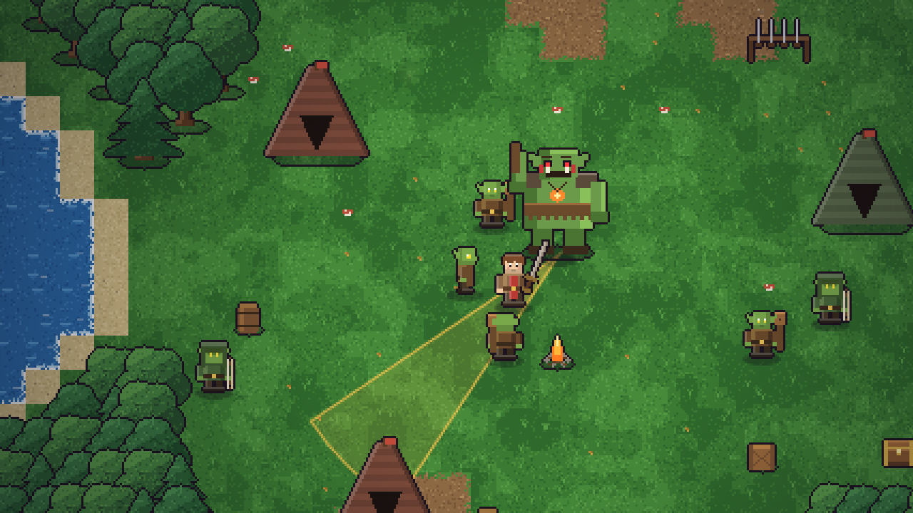

# Эмбервейл

Пиксельная фэнтези-RPG с боем в реальном времени. Выбери класс (воин, маг или разбойник), исследуй мир, сражайся с чудовищами, выполняй задания и спаси мир от Скверны. Играется в браузере (в том числе на телефоне), без сборки и зависимостей.

**Играть:** опубликованная версия на GitHub Pages (workflow `static.yml`) или локально:

```bash
npm start            # или: python3 -m http.server 8000
# открыть http://localhost:8000
```

Игра использует ES-модули, поэтому `index.html` нужно открывать через HTTP, а не через `file://`.








## Сюжет

Пламя Эмбера, древняя защита мира, угасает. Маяк Тихого Брода погас, а Скверна, запертая в Цитадели на севере, просачивается наружу. Герой должен:

1. Осмотреть погасший маяк и выслушать старейшину Орвена.
2. Добыть **первый осколок Пламени** у Грока, вождя гоблинов.
3. Отобрать **ключ от склепа** у капитана разбойников Волчьего Глаза.
4. Пройти **Склеп забытых королей**, открыть рычагами дверь и победить Полого короля ради второго осколка.
5. Перековать осколки у кузнеца и **зажечь маяк**.
6. Войти в **Цитадель Скверны** и сразиться со Скверным Владыкой.

Кроме основной цепочки есть шесть побочных заданий: лунные цветы для травницы, шкуры для кузнеца, потерянный амулет, кот Пушок (привет «Шерстинам»), паучий шёлк и страницы летописи в склепе.

## Управление

| Действие | Клавиатура / мышь | Телефон |
|---|---|---|
| Ходьба | `WASD` или стрелки | плавающий джойстик слева |
| Атака | `Пробел`, `J` или левая кнопка мыши (целится в курсор) | большая кнопка справа |
| Навык 1 / 2 | `K` / `L` (или правая кнопка мыши) | кнопки справа |
| Уклон (перекат, скачок, кувырок) | `Shift` | кнопка справа |
| Говорить, открыть, потянуть, помолиться | `E` | кнопка «E» появляется рядом с объектом |
| Зелье здоровья / маны | `1` / `2` | кнопки слева от навыков |
| Сумка и герой / журнал | `I` / `Tab` | значки сверху справа |
| Пауза | `Esc` или `P` | значок ❚❚ |

Без мыши удар сам доводится до ближайшего врага в направлении движения. Играть на телефоне лучше в горизонтальном положении.

## Классы

| Класс | Стиль | Атака | Навыки | Уклон |
|---|---|---|---|---|
| **Воин** | много здоровья, ближний бой | удар мечом по дуге | Вихрь (круговой удар), Боевой клич (с 5 ур.: урон +35%, защита) | перекат |
| **Маг** | хрупкий, но сильный на расстоянии | магический снаряд | Огненный шар (взрыв по области), Ледяная нова (с 5 ур.: урон и замедление) | скачок-блинк |
| **Разбойник** | быстрый, критует | серия ударов кинжалом, удар в спину ×1.5 | Веер ножей, Теневой шаг (с 5 ур.: невидимость и крит ×3) | кувырок |

Прокачка идёт до 15 уровня. Снаряжение: оружие, броня и амулет. Оружие и броня привязаны к классу (5 ступеней оружия, 4 ступени брони), меняют внешний вид героя. Последняя ступень оружия куётся из осколков Пламени.

## Мир

| Область | Что там |
|---|---|
| **Тихий Брод** | деревня: старейшина, кузнец, торговка, трактирщик, травница, стражник, алтарь Огня, маяк, луг со слизнями |
| **Шёпотный лес** | волки, пауки, разбойники, гоблины; озеро с островом, лагеря Грока и Волчьего Глаза, святилище, врата склепа |
| **Склеп забытых королей** | скелеты, летучие мыши, призраки; два рычага открывают дверь к Полому королю |
| **Цитадель Скверны** | воины и плевуны Скверны, лавовые рвы; последний босс |

**Алтари** лечат, восстанавливают ману и сохраняют прогресс. При гибели герой просыпается у последнего алтаря и теряет 10% золота. Боссы телеграфируют атаки красными зонами: учись уклоняться.

## Устройство кода

```
index.html, css/         интерфейс (DOM поверх canvas)
js/defs.js               константы, классы, предметы, враги
js/maps.js               карты областей (генерация с фиксированным seed)
js/state.js              состояние героя, характеристики, инвентарь
js/quests.js             квесты, NPC, диалоги (данные + движок)
js/world.js, ai.js       игровая логика: бой, ИИ врагов и боссов, лут (без DOM)
js/sprites_*.js, px.js   весь пиксель-арт рисуется кодом
js/render.js             камера, слои, частицы, освещение подземелий
js/ui.js, input.js       HUD, диалоги, сумка/журнал/магазин, джойстик
js/audio.js              музыка и звуки синтезируются в Web Audio
js/save.js               сохранения в localStorage
tests/                   проверки данных и бот-тестировщик
tools/                   скриншоты и вспомогательные страницы (Playwright)
```

Логика мира не зависит от DOM, поэтому запускается и в Node: на этом построены тесты.

## Тесты

```bash
npm test             # данные карт и квестов + смоук + бот проходит игру воином
npm run test:all     # то же для всех трёх классов
node tests/ascii.mjs forest   # нарисовать карту текстом
```

- `tests/validate.mjs` проверяет, что все NPC, враги, сундуки, порталы и рычаги достижимы, что квесты ссылаются на существующие предметы и что для каждой цели есть источник.
- `tests/smoke.mjs` прогоняет мир минуту игрового времени для каждого класса.
- `tests/bot.mjs` проходит всю игру через настоящую логику: ходит по картам (A\*), выполняет задания, покупает снаряжение, побеждает четырёх боссов.

## Публикация

Workflow `.github/workflows/static.yml` выкладывает репозиторий целиком на GitHub Pages при пуше в `main`. Манифест и сервис-воркер позволяют установить игру на главный экран телефона (на iPhone: «Поделиться» → «На экран Домой»).

Сделано в одном стиле с «Шерстинами» — MurMyak Games.
